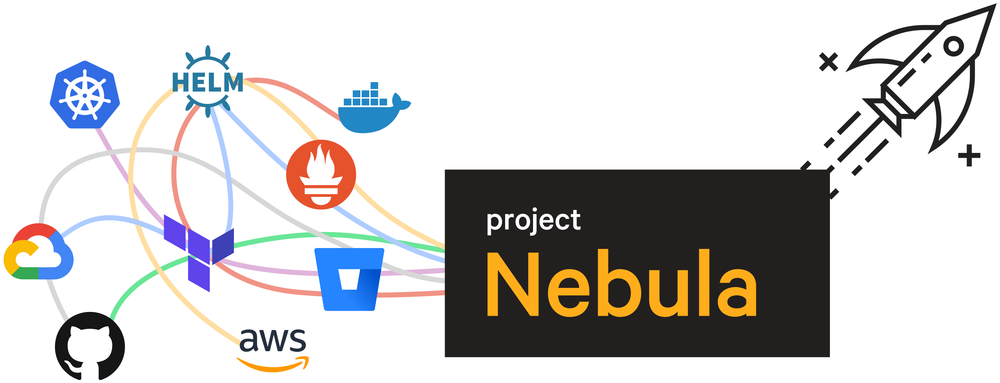

# Welcome to Project Nebula

Project Nebula helps you continuously deploy your cloud native applications and infrastructure using simple workflows.

|Helpful Project Nebula docs links|Other useful places|
|-   **Getting started**

    1.  Create a GitHub repository to use for your Nebula workflows.
    2.  [Integrate your repository](setting_up_nebula.md#) using the [Nebula web interface](https://nebula.puppet.com).
    3.  [Download and install the Nebula command line interface](setting_up_nebula.md#).
    4.  [Create a workflow and run it](nebula_create_workflow.md).

|-   **Blog posts**

[Simplify continuous deployment with Project Nebula](https://puppet.com/blog/dramatically-simplifying-continuous-deployment-project-nebula)

|
|-   **Useful links**

[Example step images on DockerHub](https://cloud.docker.com/u/projectnebula/repository/list)

[Example workflows on GitHub](https://github.com/puppetlabs/nebula-workflow-examples/tree/master/deploy-nodejs-app-to-k8s)

| |

